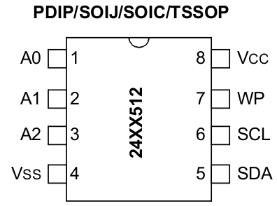
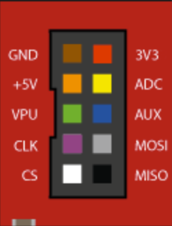
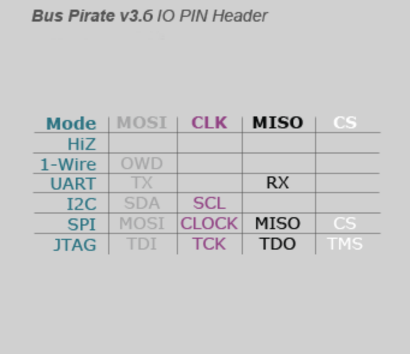

# Required Hardware

# Setup Ubuntu Development Environment
1. Edit the Density udev rule for USB devices
```bash
sudo gedit /etc/udev/rules.d/51-density.rules
```
2. Append the udev rule file with a new rule for the BusPirate
```bash
SUBSYSTEM=="usb", ATTR{idVendor}=="0403", MODE="0664", GROUP="plugdev"
```

3. Save the file
4. Reload udev Rules
```bash
sudo udevadm control --reload-rules && udevadm trigger
```

5. Plug-in the buspirate to your PCs USB port and verify that the device enumerates on the bus.
```bash
lsusb
Bus 001 Device 006: ID 0403:6001 Future Technology Devices International, Ltd FT232 USB-Serial (UART) IC
```

# Checkout Project
```bash
mkdir i2cdump
repo init -m i2cdump.xml -u ssh://git@github.com/DensityCo/buspirateeeprom  -b master
repo sync
```

# Wiring Diagram

## Microchip 24AA512


Figure - 1 - Microchip 24AA512 Pinout
&nbsp;



Figure - 2 - BusPirate Header Pinout
&nbsp;



Figure - 3 - BusPirate Logical Signals Table - Operating Mode
&nbsp;


| 24AA512 Pin   | BusPirate Pin |
| ------------- | --------------|
| Pin1 - A0     | GND           |
| Pin2 - A1     | GND           |
| Pin3 - A2     | GND           |
| Pin4 - VSS    | GND           |
| Pin5 - SDA    | MOSI          |
| Pin6 - SCL    | CLK           |
| Pin7 - WP     | GND           |
| Pin8 - VCC    | 3V3           |

# Manually Testing EEPROM Connection
1. Open /dev/ttyUSB0 serial port with your favorite terminal emulator. Minicom or screen are good choices.

